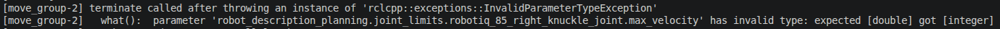
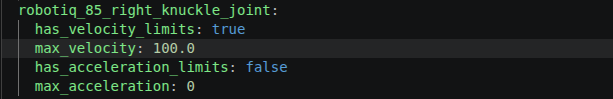
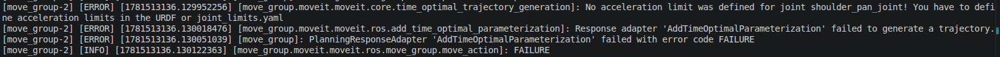
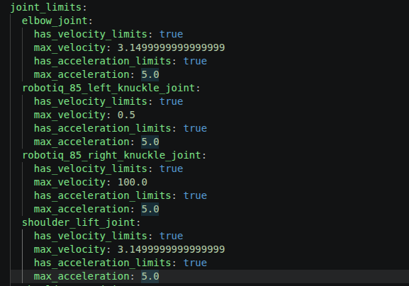
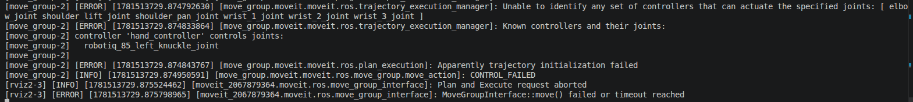
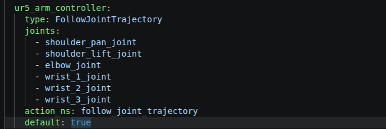

## UR5+robotiq2f_85 moveit setup

### update
1. 增加3d相机配置: sensors_3d.yaml
2. 支持切换mock和isaacsim control
3. 修改机械臂初始关节角度
4. 移除ee_link设置

### 环境配置
1. 系统环境配置
- ubuntu24.04

2. 软件环境配置
- ros2 jazzy
- ros-jazzy-xacro
- ros-jazzy-joint-state-publisher-gui
- ros-jazzy-moveit*


### 编译
1. 下载urdf仓库
```
git clone -b v0.0.2 git@github.com:WAI-f/ur5_robotiq85_description.git
```
2. 编译代码
```
cd ur5_robotiq85_description
colcon build
source install/setup.bash
```
3. 下载当前仓库代码
```
git clone -b v0.0.2 git@github.com:WAI-f/ur5_robotiq85_moveit_config.git
```
4. 编译代码
```
cd ur5_robotiq85_moveit_config
colcon build
source install/setup.bash
```

### 可视化
1. 启动rviz(不与isaac sim一起使用)
```
ros2 launch ur5_robotiq85_moveit_config demo.launch.py
```

2. 启动rviz(与isaac sim一起使用)
```  
ros2 launch ur5_robotiq85_moveit_config demo.launch.py \
    use_sim_time:=true \
    ros2_control_hardware_type:=isaac \
    joint_commands_topic:=/isaac_joint_commands \
    joint_states_topic:=/isaac_joint_states
```


### 创建moveit_config package流程
1. 启动moveit setup assistant:
```
ros2 launch moveit_setup_assistant setup_assistant.launch.py
```
- **start screen**
    - 点击**Create New Moveit Configuration Package**
    - 点击**Browser**, 选择ur5_robotiq85_rsd455.urdf.xacro所在路径
    - 点击**Load Files**, 正常加载会提示100%

- **self collisions**
    - 调整**Sampling Density**滑动条，数值越大采样密度越大，计算越准，但是计算速度也越慢
    - 点击**Generate Collision Matrix**

- **Virtual Joints**
    - 点击**Add Virtual Joint**按钮添加虚拟关节，这里是给world坐标系和机械臂base坐标系之间添加一个虚拟关节

- **Planning Groups**
    - 点击**Add group**添加ur arm group
    - 点击**Add group**添加hand group

- **Robot Poses**
    - 点击**Add Pose**添加home pose
    - 点击**Add Pose**添加detect pose
    - 点击**Add Pose**添加open pose
    - 点击**Add Pose**添加close pose

- **End Effectors**
    - 点击**Add End Effector**添加hand effector

- **Passive Joints**
    - 添加一些不参与规划的joint

- **ros2_control_URDF Modifications**
    - 点击**Add interface**按钮即可

- **ROS2 controllers**
    - 点击**Add controller**按钮添加ur arm controller:
        - 再点击**Add Planning Group Joints**, 添加ur arm group
    - 点击**Add controller**按钮添加hand controller:
        - 再点击**Add Planning Group Joints**, 添加hand group

- **Moveit controllers**
    - 设置和**ROS2 controllers**完全一致
    - 点击**Add controller**按钮添加ur arm controller:
        - 再点击**Add Planning Group Joints**, 添加ur arm group
    - 点击**Add controller**按钮添加hand controller:
        - 再点击**Add Planning Group Joints**, 添加hand group

- **Perception**
    - 主要是给相机感知模块做的设置，可以参考我的设置，也可以不设置，当前无影响

- **Launch Files**
    - 按照默认设置即可

- **Author Information**
    - 设置个人信息，按照个人需求填写即可

- **Configuration Files**
    - 点击**Browser**按钮，设置moveit_config保存路径
    - 点击**Generate Package**，进度条显示100%即完整整个config的配置
    - 点击**Exit Setup Assistant**退出gui

### 修改配置文件
1. 修改**config/joint_limits.yaml**
- 如果报错信息如下, 是参数的数据类型错误(bug)，将*100*修改为*100.0*：

修改示例：


- 如果报错信息如下, 是规划算法需要加速度约束：

将所有joint的*has_acceleration_limits*设置为*true*，*max_acceleration*设置为*5.0*：


2. 修改**config/moveit_controllers.yaml**
- 如果提示如下信息，是配置文件缺少控制机械臂关节的controller:

修改示例：


### 与isaac-sim配合使用
- topic_based_ros2_control：已在容器中配置
- 配置ur5_robotiq_85.ros2_control.xacro：已改为参数配置

### 参考
- Moveit setup assistant官方教程: [MoveIt Setup Assistant](https://moveit.picknik.ai/main/doc/examples/setup_assistant/setup_assistant_tutorial.html)
- MoveIt and Isaac sim integration: [How To Command Simulated Isaac Robot](https://moveit.picknik.ai/main/doc/how_to_guides/isaac_panda/isaac_panda_tutorial.html)